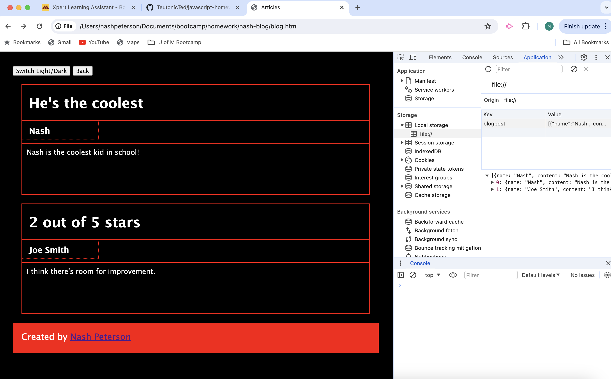

# Module 4 Homework

In this challenge, I created my personal two-page blog; utilizing concepts from the Web-APIs module to accomplish the following:

- Stringified and parsed user objects into local storage over multiple html pages, js files & css stylesheets (prescribed below)

```md
my-blog
├── assets
│   ├── css
│   │   ├── blog.css
│   │   ├── form.css
│   │   └── styles.css
│   └── js
│       ├── blog.js
│       ├── form.js
│       └── logic.js
├── index.html
├── blog.html
└── README.md
```

- Stored global data in logic.js to define how local storage should be written/stored & store the logic for the light/dark mode button.
- Used the form.js to define how the data entered into the form should be written into local storage, the event listener on the submit button, an alert notifying the user of incomplete fields.
- Used the blog.js file how to append the user array into the local storage and how to display the parsed data onto  blog.html (after every new entry).
- Created a back button to return to index.html to write more blogs.

- Used styling sheets to design and format the buttons on the page.
- Created a footer with an imbedded link to my GitHub profile.


## Link to Deployed Version

[Click here to see the deployed version](https://teutonicted.github.io/nash-blog/)

## Screenshot of the Deployed Version

